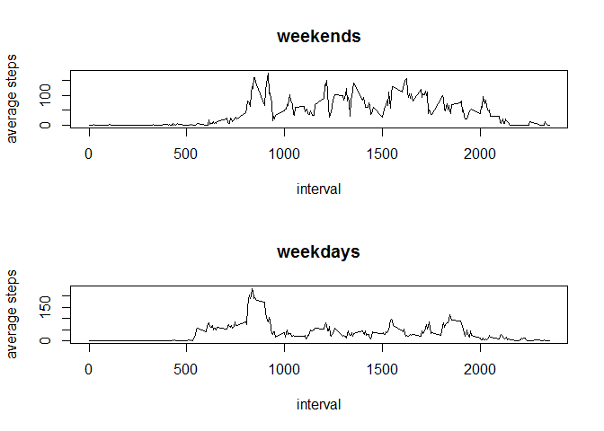

# Reproducible Research: Peer Assessment 1


## Loading and preprocessing the data


```r
raw_data <- read.csv("activity.csv")
summary(raw_data)
```

```
##      steps               date          interval   
##  Min.   :  0.0   2012-10-01:  288   Min.   :   0  
##  1st Qu.:  0.0   2012-10-02:  288   1st Qu.: 589  
##  Median :  0.0   2012-10-03:  288   Median :1178  
##  Mean   : 37.4   2012-10-04:  288   Mean   :1178  
##  3rd Qu.: 12.0   2012-10-05:  288   3rd Qu.:1766  
##  Max.   :806.0   2012-10-06:  288   Max.   :2355  
##  NA's   :2304    (Other)   :15840
```


## What is mean total number of steps taken per day?
First we need to compute the total steps taken per day by summing up all the steps taken in the intervals within a particular day, then histogram can be made to visualize the daily activity.

```r
total_steps_per_day <- 
    tapply(raw_data$steps, raw_data$date, sum, na.rm = TRUE) 
hist(total_steps_per_day)
```

 

The mean total number of steps taken per day is:

```r
mean(total_steps_per_day)
```

```
## [1] 9354
```

The median number of steps taken per day is:

```r
median(total_steps_per_day)
```

```
## [1] 10395
```


## What is the average daily activity pattern?

We can also analyze the activity for each of the 5-minute interval, averaged accross different dates. We first calculate the average steps per interval accross all dates, and then make time series plot of it.

```r
aver_steps_per_interval <-
    tapply(raw_data$steps, raw_data$interval, mean, na.rm = TRUE)

plot(unique(raw_data$interval), aver_steps_per_interval, type = "l")
```

 

Then we calculate the max interval which contains the maximum number of steps on average accross all the days

```r
raw_data$interval[which.max(aver_steps_per_interval)]
```

```
## [1] 835
```


## Imputing missing values
First of all let's get some sense about how much data is missing. The following reports the number of missing steps from the dataset.

```r
steps_missing <- is.na(raw_data$steps)
length(raw_data$steps[steps_missing])
```

```
## [1] 2304
```

For a particular interval with missing steps, we impute the missing steps with mean value of steps for that interval over all observation days

```r
# Make copy of the raw data
imputed_data <- raw_data
# define a function to impute missing steps with average steps per interval for a particular row of data
impute_missing_steps <- function(row_index)
{
    aver_steps_per_interval[as.character(raw_data$interval[[row_index]])]
}
# lapply the above function to all rows of missing data
imputed_data$steps[steps_missing] <- sapply(X = which(steps_missing),
    FUN = impute_missing_steps)
```

We can then make similar histogram of total number of steps each day after imputing missing data.

```r
total_steps_per_day_imputed <- 
    tapply(imputed_data$steps, imputed_data$date, sum, na.rm = TRUE)
hist(total_steps_per_day_imputed)
```

 

And we calculate mean and median after imputing the missing data

```r
mean(total_steps_per_day_imputed)
```

```
## [1] 10766
```

```r
median(total_steps_per_day_imputed)
```

```
## [1] 10766
```

We can see imputing missing data changes the mean and median value of daily activity, and for this data set if increases both values.

## Are there differences in activity patterns between weekdays and weekends?

We might want to know whether the activity pattern will be different between weekdays and weekends. For this we calculate the average steps per interval for all weekends, and then for all weekdays, and then make time series plots for them respectively.


```r
# Set this so that weekdays returns dates in English
Sys.setlocale("LC_TIME", "English")
```

```
## [1] "English_United States.1252"
```

```r
# Filter all the weekends
is_weekend <- 
    (weekdays(as.Date(imputed_data$date)) %in% c("Saturday", "Sunday"))
# Average steps per interval for all weekends
aver_steps_per_interval_weekends <-
    tapply(raw_data$steps[is_weekend], raw_data$interval[is_weekend], mean, na.rm = TRUE)
# Average steps per interval for all weekdays
aver_steps_per_interval_weekdays <-
    tapply(raw_data$steps[!is_weekend], raw_data$interval[!is_weekend], mean, na.rm = TRUE)
# Time series plot of weekends and weekdays respectively
par(mfrow=c(2,1))
plot(unique(raw_data$interval), 
     aver_steps_per_interval_weekends, type = "l",
     main = "weekends", xlab = "interval", ylab = "average steps")
plot(unique(raw_data$interval), 
     aver_steps_per_interval_weekdays, type = "l",
     main = "weekdays", xlab = "interval", ylab = "average steps")
```

 

From the above plots it suggests more activites over weekdays.
